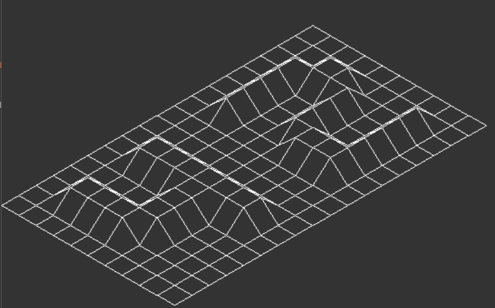
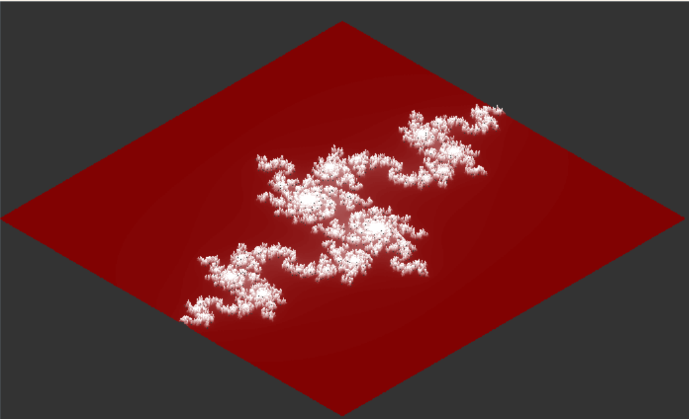

# 🚀 FdF - 3D Wireframe Renderer

[](LICENSE)
[](https://github.com/ondbeh/fdf/stargazers)
[](https://github.com/ondbeh/fdf/issues)
[](https://42.fr/)

> A simple 3D wireframe renderer that transforms height maps into 3D landscapes

## 📋 Table of Contents

- [Overview](#-overview)
- [Features](#-features)
- [Demo](#-demo)
- [Installation](#-installation)
- [Usage](#-usage)
- [Contributing](#-contributing)
- [Contacts](#-contacts)
- [License](#-license)

## 📖 Overview

FdF (Fil de Fer) is a graphics project that renders wireframe models from height maps. The program takes a 2D grid of numbers as input, where each number represents the height of a point, and transforms it into a 3D wireframe representation. This project is developed as part of the 42 school curriculum and serves as an introduction to graphics programming.

---

## ✨ Features

- ✅ 3D wireframe rendering of height maps
- ✅ Custom colors from map file

---

## 🎮 Demo



---

## 🔧 Installation

1. Clone the repository:
   ```bash
   git clone https://github.com/ondbeh/fdf.git
   ```
2. Navigate to the project directory:
   ```bash
   cd fdf
   ```
3. Compile the project:
   ```bash
   make
   ```

### Requirements

- GCC compiler
- Make
- MLX42 library (included ad a submodule)
- X11 libraries (for Linux) or Cocoa (for macOS)

---

## 📚 Usage

Run the program with a map file:

```bash
./fdf maps/42.fdf
```

### Map Format

The map file is a text file with a grid of numbers, where each number represents the height of a point:

```markdown
0 0 0  0  0 0 0  0  0 0
0 0 0  0  0 0 0  0  0 0
0 0 10 10 0 0 10 10 0 0
0 0 10 10 0 0 10 10 0 0
0 0 0  0  0 0 0  0  0 0
0 0 0  0  0 0 0  0  0 0
0 0 0  0  0 0 0  0  0 0

```

Optional color values can be specified in hexadecimal after each height value:

```markdown
0,0xFFFFFF 0,0xFFFFFF  0,0xFFFFFF
0,0xFFFFFF 10,0xFF0000 10,0xFF0000
0,0xFFFFFF 0,0xFFFFFF  0,0xFFFFFF
```

---

## 🤝 Contributing

- [Ondřej Běhávka](https://github.com/ondbeh)

---

## 📞 Contacts

[](https://github.com/ondbeh)

[](mailto:ondbeh@gmail.com)

[](https://www.linkedin.com/in/ondrej-behavka/)

---

## 📜 License

This project is licensed under the MIT License - see the [license](LICENSE) file for details.
